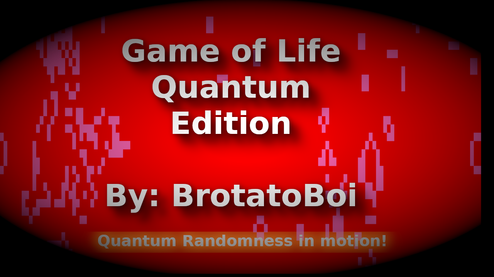

## The Game of Life: Quantum Edition

## Description:
A Python recreation of Conway’s Game of Life that uses **quantum randomness** to determine each cell’s initial state.

## Current Version: 
**V2.5 - 2025.10.13**

## Requirements:
  * python==3.13.7
  * qiskit==2.2.1
  * qiskit-aer==0.17.2
  * colorama==0.4.6
  * pygame==2.6.1

## Installation and Quickstart:
In the project directory run the following commands:

```bash
git clone https://github.com/BrotatoBoiV2/Game-of-Life
cd Game-of-Life
python3 -m venv ./life
. ./life/bin/activate
pip install -r requirements.txt
```
Then run:

```bash
python3 ./main.py
```


## This project demonstrates:
  * Quantum-based randomness for cell initialization using Qiskit and AerSimulator.
  * A double-buffered, terminal-rendered Game of Life that ensures smooth updates.
  * Edge wrapping (toroidal grid) for infinite-looping patterns.
  * Additional seeding of classic patterns (gliders, blinkers, blocks, more to come) to explore dynamic behaviors.
  * Colored terminal visualization for clear alive/dead cell distinction.

## Features:
  * Randomized initial states using quantum circuits.
  * Double-buffered update system for accurate neighbor calculation.
  * Support for oscillators, gliders, and still lifes.
  * Toroidal grid wrapping to prevent edge stagnation.
  * Extensible for custom patterns or "immortal" cells.

## Demo:
[](https://www.youtube.com/watch?v=oJUv5a1jjpE)

## Why Quantum Randomness?
 Each cell’s initial state (alive or dead) is determined by a single-qubit Hadamard gate, introducing true quantum randomness through Qiskit rather than relying on classical pseudorandom generators.

## Updates:
For detailed update history, see the [CHANGELOG](docs/CHANGELOG.md)

## License:
This project is protected under the **GNU General Public License v3.0 (GPLv3)**. To see more, visit the [LICENSE](LICENSE)

---

**If you like this project, consider giving it a star.**
